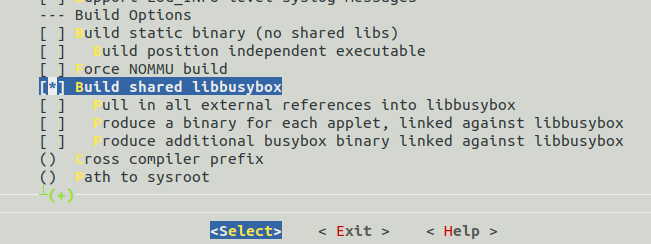

This page is for build qemu arm linux kernel environmnet.
### 目的 
使用qemu搭建一个arm开发平台的内核调试环境，支持程序运行和内核模块的挂载。
所有脚本和配置文件[git地址](https://github.com/linhaidong/qemu-arm)
### 构建过程

#### 1.搭建交叉编译工具
 交叉编译工具使用arm-linux-gnueabi,如果有多个版本使用update-alternative工具进行多个版本的控制。
安装arm的交叉编译工具链
```
sudo apt-get install gcc-arm-linux-gnueabi 
```

#### 2.busybox
2 .1 下载最近的busybox-1.31.1，解压。

2.2 修改makefile中的ARCH，CROSS_COMMPILE
 ``` shell
CROSS_COMPILE ?= arm-linux-gnueabi-
ARCH ?= arm
```
2.3 选择相关配置
输入make menuconfig进入，配置选项。
 由于要支持执行文件的运行，因此需要配置成动态链接的形式。否则在执行程序的时候，会提示“/bin/sh:cmd not found”
在”Busybox Settings ---> Build Options --->“ 关闭“Build BusyBox as a static binary。
打开”Build shared libbusybox“。
 关闭”Produce a binary for each applet“与”Produce additional busybox binary“。
 
关闭cosole cotrol：

保存并退出

2.4 编译生成文件系统
在busybox目录下，执行make && make install ，在_install目录生成了基本文件系统所需的文件。

2.5 准备设备文件和启动脚本
1. 链接库文件
查看busybox依赖的链接库

 locate libc.so.6查看文件的位置，拷贝相关文件到lib目录下。

2. etc文件
   etc文件主要创建内核启动inittab文件(busybox sh启动的时候会检查并运行相关的文件内容)，启动脚本，文件挂载配置脚本。
   后面使用了shell脚本，自动化建立文件系统，因此这里单独创建了一个etc目录。
   在etc目录下建立inittab文件
```
::sysinit:/etc/init.d/rcS
console::askfirst:-/bin/sh
::ctrlaltdel:/bin/nmount -a -r 
```
   在etc/init.d.n目录下建立一个rcS文件,写入如下内容，并用chmod +x改变文件的执行权限。
```
#!/bin/sh
PATH=/sbin:/bin:/usr/sbin:/usr/bin
LD_LIBRARY_PATH=/lib
export PATH LD_LIBRARY_PATH

mkdir -p /proc
mkdir -p /tmp
mkdir -p /sys
mkdir -p /mnt
/bin/mount -a
mkdir -p /dev/pts
mount -t devpts devpts /dev/pts
echo /sbin/mdev > /proc/sys/kernel/hotplug
mdev -s
echo "---------------------------"
echo "   welcome to a9 vexpress  "
echo "---------------------------"
```
上面使用了mount -a命令，该命令会自动的读取/etc/fstab并挂载目录。
建立/etc/fstab文件配置自动挂载选项。

```shell
proc /proc proc defaults 0 0 
tmpfs /tmp tmpfs defaults 0 0 
sysfs /sys sysfs defaults 0 0 
tmpfs /dev tmpfs defaults 0 0
debugfs /sys/kernel/debug debugfs defaults 0 0
```
3.  使用虚拟sdk文件，建立文件系统。使用了自动挂载脚本，脚本内容如下：
``` shell
mkdir -p rootfs/{dev,lib}
cp -fr ~/busybox-1.31.1/_install/* rootfs/
cp -fr /usr/arm-linux-gnueabi/lib/* rootfs/lib/
cp -fr etc  rootfs/
cp -fr iptables/sbin/* rootfs/sbin/
cp -fr iptables/lib/* rootfs/lib
cd ./rootfs/dev/
sudo mknod -m 666 tty1 c 4 1
sudo mknod -m 666 tty2 c 4 2
sudo mknod -m 666 tty3 c 4 3
sudo mknod -m 666 tty4 c 4 4
sudo mknod -m 666 console c 5 1
sudo mknod -m 666 null  c 1 3
cd ../../
dd if=/dev/zero of=rootfs.ext3 bs=1M count=100
mkfs.ext3 rootfs.ext3
sudo mount -t ext3 rootfs.ext3 /mnt/ -o loop
sudo cp -fr ./rootfs/* /mnt/
sudo umount /mnt/
```
这样就做好了linux内核启动所需的文件系统，使用qemu的时候，执行root=/dev/mmcblk0 并指定-sd rootfs.ext3即可。
        
      
#### 3. 内核编译
下载所需版本的内核，按照上面busybox的配置修改makefile支持交叉编译。
使用下面的命令编译内核。
```        
make bzImage -j 4
make dtbs
````
#### 4. 网络配置


### 问题：
####1. can't access tty,job control turned off
进入busybox源码中，make menuconfig; 2. 找到选项中的 Applets->Shells->ash->job control，取消，重新编译； 3. 使用新的busybox测试，OK。

#### 2. 终端不能正常的工作
  在启动内核后，发现终端不能正常的工作，输入的字符会少或者不全。
  在/etc/inittab文件中，去掉::respawn:-bin/sh
   
#### 3. 内核目录 
rmmod: can't change directory to '/lib/modules': No such file or directory
在文件系统中创建目录，/lib/modules/4.0.0\+/

